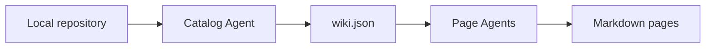

# Overview

`yread` turns a local source repository into a structured Markdown wiki. It first builds a catalog, then starts independent page agents to inspect code and write focused documentation.

This static sample demonstrates the output layout. It is not a real model-generated run.
