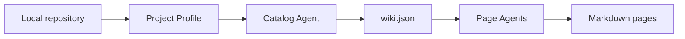

# Overview

`yread` turns a local source repository into an architecture-first Markdown wiki. It first builds a project profile and catalog, then starts independent page agents to inspect evidence files and write focused documentation for human understanding.

This static sample demonstrates the output layout. It is not a real model-generated run.
